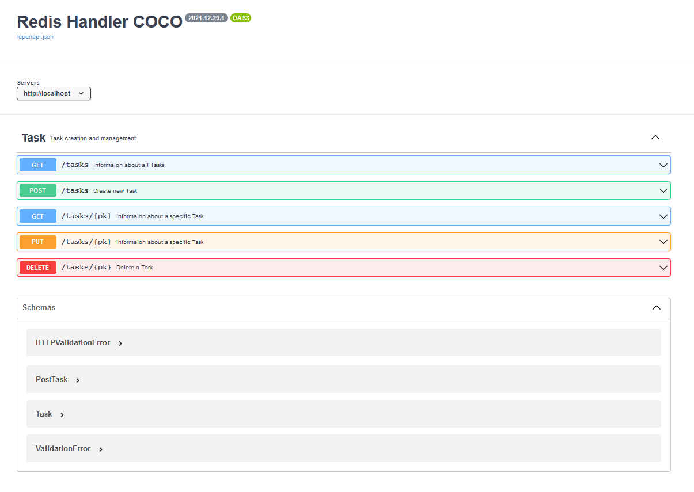

<h2 align="center">FastAPI&Redis OM-Example </h2>
<p align="center">
    <em></em>
</p>
<p align="center">
<a href="https://github.com/panocbik/FastAPI-Redis-example/blob/master/LICENSE" target="_blank">
    
</a>
<a href="https://github.com/panocbik/FastAPI-Redis-example" target="_blank">
    
<a href="https://github.com/panocbik/FastAPI-Redis-example" target="_blank">
    
</a>
</p>

---

This repo walks you through a simple demo on how to handle FastAPI with Redis server! Specificaly, we will use:

- **[FastAPI](https://github.com/tiangolo/fastapi)** to creates the backend RestAPI 

- **[Redis OM](https://github.com/redis/redis-om-python)** to models and stores the data at Redis server

- **[TaskTiger](https://github.com/closeio/tasktiger)** for run the tasks asynchronously in Redis queue

- **[Pub/Sub](https://redis.io/topics/pubsub)** messaging with remote machine via Redis Topic

## Quick-Start

First, set environment variables for Redis Server in the `.env` file as a below:

```shell
REDIS_HOST=redis
REDIS_PORT=6379
REDIS_PASS=<password> 
```

<small>*The .env file must be in the same directory as the docker-compose.yml file</small>

Then run the following command to start the service via the `docker-compose.yml` file:

```shell
$ docker-compose up --build
```

## Interactive API swagger

At http://127.0.0.1/swagger you will see the automatic interactive API documentation (provided by Swagger UI):

<p align="center">
  <a href="#"></a>
</p>

## Project structure

The following structure displays the directory sections of the application:

```shell
.
├── Dockerfile
├── LICENSE
├── README.md
├── app
│   ├── __init__.py
│   ├── api
│   │   ├── __init__.py
│   │   ├── errors
│   │   │   ├── __init__.py
│   │   │   └── string.py
│   │   └── routes
│   │       ├── __init__.py
│   │       └── task.py
│   ├── core
│   │   ├── __init__.py
│   │   ├── config.py
│   │   ├── dependencies.py
│   │   ├── events.py
│   │   └── settings
│   │       ├── __init__.py
│   │       ├── app.py
│   │       ├── base.py
│   │       └── production.py
│   ├── main.py
│   └── models
│       ├── __init__.py
│       └── task.py
├── docker-compose.yml
└── requirements.txt
```